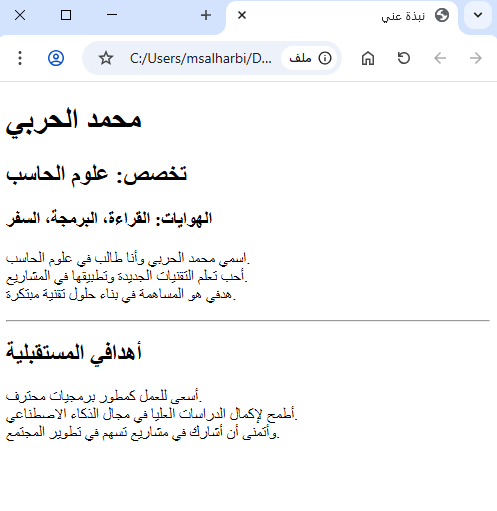

# واجب عملي: إنشاء صفحة HTML شخصية (1 ساعة)

## أهداف الواجب
- تعزيز فهم الهيكل الأساسي لصفحات HTML.
- ممارسة استخدام العناوين والفقرات والفواصل.
- تنمية مهارات تنظيم المحتوى داخل صفحة ويب.

---

## متطلبات الواجب
قم بإنشاء صفحة HTML باسم **about_me.html** تتضمن التالي:

1. **العنوان (Title)**  
   - ضع عنوان الصفحة في وسم `<title>` باسم: "نبذة عني".

2. **العناوين (Headings)**  
   - استخدم `<h1>` لكتابة اسمك.  
   - استخدم `<h2>` لكتابة تخصصك أو مجالك الدراسي.  
   - استخدم `<h3>` لإضافة هواياتك المفضلة.

3. **الفقرات (Paragraphs)**  
   - أضف فقرة قصيرة تعرف فيها بنفسك (3–4 جمل).  
   - أضف فقرة أخرى عن أهدافك المستقبلية.

4. **الفواصل (Breaks & Horizontal Lines)**  
   - ضع فاصل أسطر `<br>` لفصل جملة عن أخرى داخل الفقرات.  
   - ضع خط أفقي `<hr>` بين قسم "نبذة عني" وقسم "أهدافي المستقبلية".

5. **التعليقات (Comments)**  
   - أضف تعليق في الكود يوضح بداية قسم "نبذة عني".  
   - أضف تعليق آخر يوضح بداية قسم "أهدافي المستقبلية".

**نقطة مهمة**: حاول أن تجعل الصفحة بسيطة ومنظمة، ولا تنسَ حفظ الملف في مجلد المشروع الخاص بك.

---
## نموذج


---
## تسليم الواجب
- احفظ الملف باسم:
  ```
  about_me.html
  ```
- تأكد من أن الصفحة تعمل عند فتحها في المتصفح.
- ارفع الصفحة على [منصة التدرب الإلكتروني](https://tvtclms.edu.sa)
---

## معايير التقييم
- [ ] تم إنشاء الهيكل الأساسي للصفحة بشكل صحيح (`<!DOCTYPE html>`, `<html>`, `<head>`, `<body>`).
- [ ] يحتوي الملف على العنوان في شريط المتصفح.
- [ ] استخدام صحيح للعناوين (H1–H3).
- [ ] وجود فقرتين على الأقل (نبذة + أهداف).
- [ ] استخدام `<br>` و `<hr>` في أماكن مناسبة.
- [ ] وجود تعليقات توضح أقسام الكود.
- [ ] صفحة تعمل بشكل صحيح في المتصفح.
